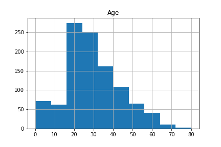
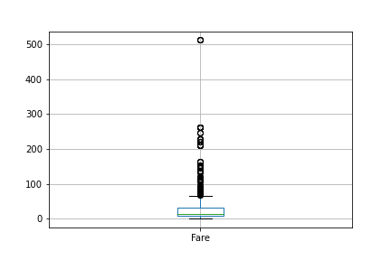
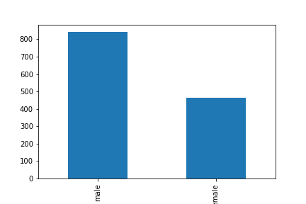
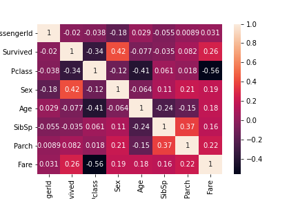

# Exploratory data analysis of titanic dataset

## Introduction
This report aims to realize an exploratory data analysis for extract meaningful insights
about the sinking of titanic. The dataset used was taken Kaggle and can be founded
in this [link](https://www.kaggle.com/c/titanic/data).

## Were titanic passengers young?
For better analyse the passengers age, an histogram was plotted.

The figure shows that the passenger data is skewed for the smaller values, having few
people with high ages. To get a better sense of the data, mean
was calculated in order to exclude outliers and have a view of the central trend of the data.

At last, the standard deviation was calculated.

The fact that the standard deviation is half the average is yet another fact to support the hypothesis that most of the passengers on the titanic were young.

## Were the titanics passengers wealthy?
For better analyse the passengers age, an boxplot of the passengers fare was plotted.

The figure shows that the data frame has many values above the interquatile range. So, to get a better idea of the
central location of data, the median was chosen because it is a robust metric.

At last, the MAD (median absolute deviation) was calculated to have an idea of the variability of the sample.

Then, one can conclude that the majority of passengers are not wealthy according to the median and median absolute deviation. Besides that, as show by the boxplot, there
is a small but very wealthy part of the passengers.

## Were most of the passengers a man?

The figure shows that the majority of the passengers were male, which may be related to the fact that greater male independence at that time.

## Was there a greater chance for women to survive?

To calculate the correlation matrix, one hot encoding was used, where "female" was mapped to the value 1 and "male" to 0.

As one can see from the correlation matrix, there is a strong positive correlation between being female and the variable that denotes if a passenger survived or not. This can be explained by the fact that women and children were the first to evacuate the sinking ship.